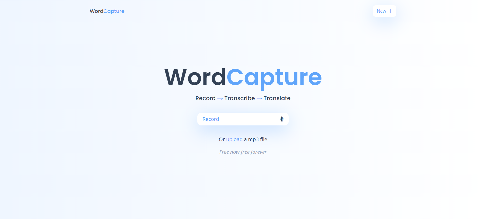

# [WordCapture](https://word-capture.netlify.app/)

WordCapture is a Vite-powered React application designed for transcribing and translating speech or uploaded audio files (.mp3 or .wav). Users can easily convert speech to text, copy or download the transcription, and translate the text into various languages with options to copy or download the translated text.

## Features

-   **Record Speech**: Capture live speech using your device's microphone.
-   **Upload Audio Files**: Upload `.mp3` or `.wav` files for transcription.
-   **Transcription**: Convert speech to text.
-   **Copy or Download Transcription**: Easily copy the transcribed text to clipboard or download it as a text file.
-   **Translation**: Translate the transcribed text into multiple languages.
-   **Copy or Download Translated Text**: Conveniently copy the translated text to clipboard or download it as a text file.

## Installation

Follow these steps to set up WordCapture on your local machine:

1. Clone the repository:

    ```bash
    git clone https://github.com/VivekChaurasia03/WordCapture.git
    ```

2. Navigate into the project directory:

    ```bash
    cd WordCapture
    ```

3. Install dependencies:

    ```bash
    npm install
    ```

4. **Install Tailwind CSS:**
   Install Tailwind CSS via npm and create the necessary configuration files.

    ```bash
    npm install -D tailwindcss postcss autoprefixer
    npx tailwindcss init -p
    ```

5. **Configure Tailwind CSS:**
   Update `tailwind.config.js` with the paths to your template files:

    ```js
    /** @type {import('tailwindcss').Config} */
    export default {
        content: ["./index.html", "./src/**/*.{js,ts,jsx,tsx}"],
        theme: {
            extend: {},
        },
        plugins: [],
    };
    ```

6. **Add Tailwind directives to your CSS:**
   In your `index.css` file (or equivalent), add the Tailwind directives:

    ```css
    @tailwind base;
    @tailwind components;
    @tailwind utilities;
    ```

7. **Run the development server:**

    ```bash
    npm run dev
    ```

    The app should now be running at `http://localhost:5173`.

## Usage

1. Click on the microphone icon to start recording or upload a `.mp3` or `.wav` file.
2. Navigate to the transcription page where you can reset or click "Transcribe".
3. Click "Transcribe" to get the transcription of the audio.
4. Copy the text or download it as a text file.
5. Optionally, translate the text.
6. Copy the translated text or download it as a text file.

This streamlined guide highlights the key steps users can follow to utilize the WordCapture application effectively.

## Build

To create a production build of the application, run:

```bash
npm run build
```

This will generate optimized static files in the `dist` directory, ready for deployment.

To view the production build of the application, run:

```bash
npm run preview
```

## Contributing

Contributions are welcome! Feel free to open issues or pull requests to suggest features, report bugs, or provide improvements.

## Application Screenshot


